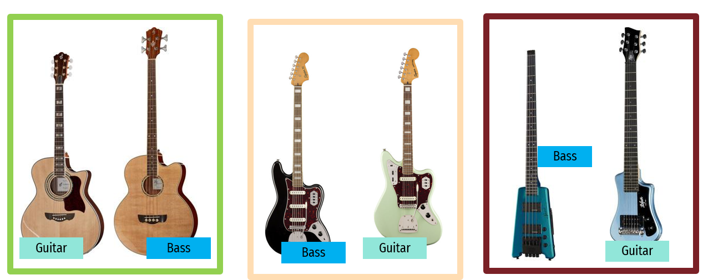
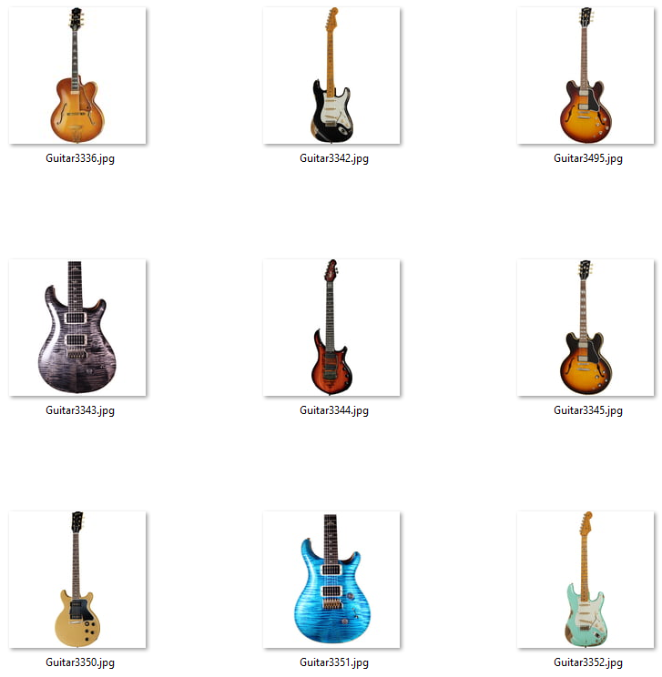
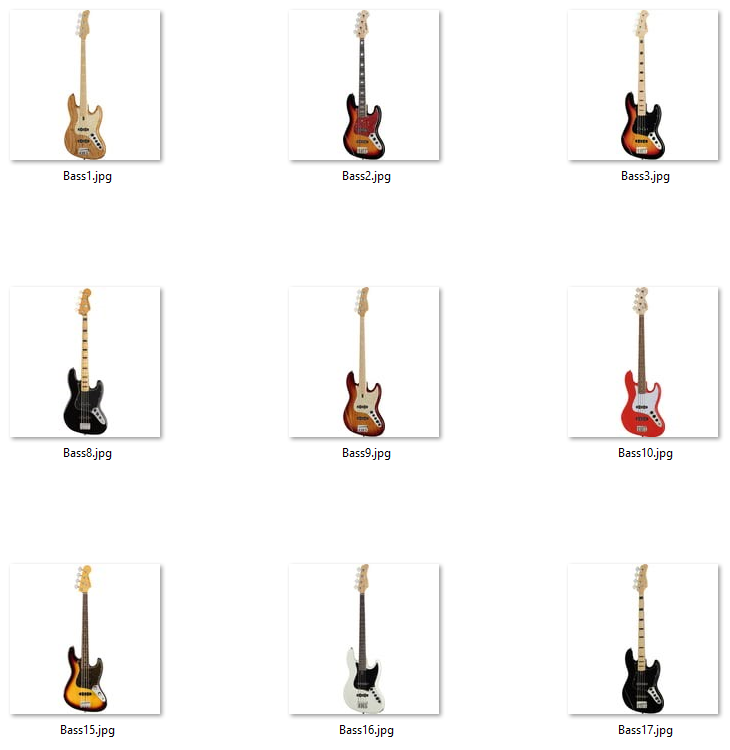

# GuitarBassClassificationCNN

  

Guitar and Bass are among the most popular stringed instruments in the world, being part of the typical rock-and-roll
ensemble.
However, distinguising between these two visually has been a problem for ages, specially for the general public.
This has brought hate and laughs to the community in equal share.

Back in the day, bass and guitar differed in the number of strings they had, as well as the thickness of those...but
with people adding crazy amount of strings to these two instruments, telling them apart is only getting more difficult
to solve!
This silly little project was created to explore CNNs for classification using a real-world training data, extracted
from an actual musical instruments shop : [Thomann](https://www.thomann.de/).

This repo contains all the code for the **web-scraping** process, as well as the **CNN training and inference**.

## About the project

This is a Convolutional Neural Network project carried out for the Automated Programming course of the MsC. in Computer
Science and Techonology at [Universidad Carlos III de Madrid](https://www.uc3m.es/Inicio)
The project consists mainly of two Google Colab Notebooks, one for the web-scraper and another for the CNN.

The scraper `Thomann_Web_Scraping_coredamnwork.ipynb` is probably deprecated by now just because of the changes that
that Thomann's website might have suffered.
This script makes use of the _requests_ and _BeautifulSoup_ libraries.
The resulting **dataset** contains 8000 images of bass and guitars (150x150 RGB, thumbnail-like). There is an imbalance
on the number of guitars (6924) vs bass images (1076).

The CNNs is implemented in Pytorch (see `Bass&Guitar_Convolutional_Net_coredamnwork.ipynb`) and everything was tested on
top of Google Colab/Drive File System.
You can find the full report of the project and the final presentation in the `/docs` folder (in Spanish though).

## Dataset and models

The complete dataset (obtained in 2019) as well as pre-trained models for inference can be
downloaded  [here](https://drive.google.com/drive/folders/12QiXJj9cZJzijI63JD5-70n2o_QhvOj5?usp=sharing).

  
<comment> Guitar examples</comment>

  
<comment> Bass examples</comment>

